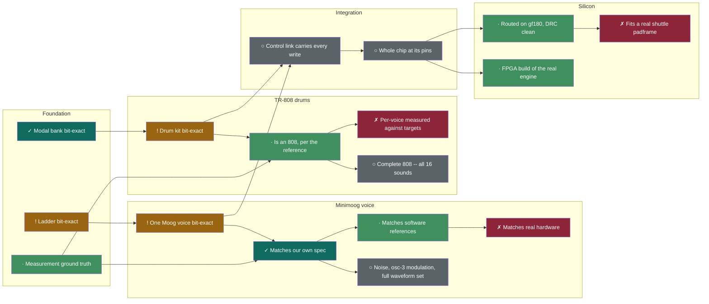

# gf180-parasynth

A Minimoog-shaped paraphonic synthesizer voice — three detuned oscillators from
the held keys into a nonlinear four-pole ladder filter — with a drum section
whose tuned bodies are a modal resonator bank, targeting GlobalFoundries
**gf180mcu**: a Minimoog and a TR-808 in one chip, driven over SPI by a
USB-MIDI microcontroller. A 2AM Logic canary block.

## Status: a chip-level RTL, bit-exact against its models, synthesised to gf180mcu. No layout, no hardware.

Being precise about this, because "synth" covers six different things:

| | | |
|---|---|---|
| 1 | Float model, playable in real time | **done** — `audition/` |
| 2 | Fixed-point model of the whole voice | **done** — `model/`. Every per-sample operation is integer; one continuous voice with retrigger, glide, a VCA after the filter and a resonance-compensation ROM (DR 0003–0006, proposed). Float remains only where the host computes register values and ROM contents from physical units (Hz → increment, seconds → rate) |
| 3 | RTL, bit-exact against (2) | **done, in simulation** — the ladder (both filter contexts), the modal bank, the whole voice (`rtl-sketch/voice_dp.v`: 383,460 frames over 37 scenario segments — every waveform including the Model D set revision 9 adds, the noise source in both colours, oscillator 3 as a modulator on both destinations, every note and the clamped increments, glide up/down/at its limits, gate/trig/retrigger, a release to exactly zero, paraphonic keys, the register extremes, three audition sequences — every sample, every tap of contract 16.4 and the final state) and the drum section (`rtl-sketch/drum_kit.v`: 172,063 frames, both buses) are each identical to their model with no tolerance, and every bench is shown to fail: **28 injected defects** (3 ladder, 5 modal, 12 voice, 8 drum), a timing control that violates the coefficient hold, and two stubs — `voice_dp_stub.v` with every output X and `ladder_dp_stub.v` with every output 0. `touch_dp.v` is deleted |
| 4 | The chip: `rtl-sketch/synth_top.v` — SPI link (DR 0007 rev 2), voice, the real drum engine, I2S | **bit-exact at its pins against `model/synth_top_model.py`** — 2 040 I2S periods decoded from BCLK/LRCLK/SDATA, every one identical to the model, 14 negative controls each shown to turn it red (`rtl-sketch/verify_synth_top.py`). The placeholder is gone; `drum_regs.v` + `drum_kit.v` are wired in (contract 17.23 closed) |
| 5 | FPGA bitstream on real hardware | not started |
| 6 | gf180mcu ASIC | **placed and routed** ([docs/pnr-synth-top.md](docs/pnr-synth-top.md)). The chip as it now stands, with `drum_kit`, is **1.979 mm² of standard cells in 59 289 instances — larger than the whole 1.73 mm² quarter slot** (118.3 % utilisation, will not place). It routes clean in **two** quarter slots: 3.465 mm² die, **60.1 % utilisation, 0 DRC violations**, setup +10.17 ns and hold +1.14 ns at ss_125C_4v50. The drum section is 62 % of it. The earlier chip with the placeholder drums did fit the quarter slot, at 56.7 %. No LVS, no sign-off DRC, no gate-level simulation |

The cell counts in the sections below are PDK-neutral yosys output from the
block benches; the mm² figures are gf180mcu cell area at tt/5 V with `*_1`
cells allowed, and **cell area is not die area** — see ARCHITECTURE.md
section 10 for where the chip sits against the wafer.space quarter slot.

## Where we are

### The board

<!-- BOARD:BEGIN -->
**19 of 100 acceptance cases have a valid measurement.** 6 pass · 13 fail · 4 no verdict · 77 not run.

| | cases | valid | pass | fail | no verdict | not run |
|---|---:|---:|---:|---:|---:|---:|
| Drums | 32 | 12 | 3 | 9 | 4 | 16 |
| Mono | 32 | 1 | 0 | 1 | 0 | 31 |
| Filters | 24 | 3 | 0 | 3 | 0 | 21 |
| Ensemble | 12 | 3 | 3 | 0 | 0 | 9 |

Every case is in [`docs/scorecard/BOARD.md`](docs/scorecard/BOARD.md). **Coverage is reported separately from agreement on purpose** — a case without a verdict is missing verification, not evidence the instrument is wrong, and it must not be able to flatter a percentage.
<!-- BOARD:END -->

### Rate, measured from git

<!-- HISTORY:BEGIN -->
Measured from git, not remembered. **123 commits over 40 hours.**

| | now | per hour |
|---|---:|---:|
| tests | 642 | 16.2 |
| injected controls | 82 | 2.1 |
| bit-exact verifiers | 7 | — |
| lines of RTL | 4,960 | 125 |

**Cycle time, which is the measure that matters.** 46 merged pull requests, **median 14 minutes** from open to merged, and PR size barely moves it — large changes (>1000 lines) median 16 minutes against 14 for small. That is because the work happens in the agent *before* the PR opens, so the real cost is agent wall-clock: **4–25 minutes** for a brief with one deliverable, **2–3.5 hours** for one containing "and" several times over.

**None of this measures whether the instrument sounds right.** A count of tests is not coverage — twenty variations of one assertion count twenty. The acceptance board above is what measures the instrument, and it is the number to watch.
<!-- HISTORY:END -->

### The capability graph

<!-- DAG:BEGIN -->


| | node | status | evidence |
|---|---|---|---|
| `F1` | Ladder bit-exact | **STALE** | rtl-sketch/ladder_dp.v changed since node/F1-ladder was cut |
| `F2` | Modal bank bit-exact | **STAMPED** | node/F2-modal (not re-run; verifier is slow) |
| `F3` | Measurement ground truth | **GREEN** | 133 passed in 1.77s |
| `M1` | One Moog voice bit-exact | **STALE** | rtl-sketch/voice_dp.v changed since node/M1-voice was cut |
| `M2` | Matches our own spec | **STAMPED** | node/M2-minimoog |
| `M3` | Matches software references **fidelity** | **GREEN** | docs/reference-compare-results.json EXISTS ONLY -- no verdict declared |
| `M4` | Matches real hardware **fidelity** | **BLOCKED** | 0 of 222 Legowelt recordings qualify -- needs one documented self-oscillation clip |
| `M5` | Noise, osc-3 modulation, full waveform set | **TODO** | issue #48 |
| `D1` | Drum kit bit-exact | **STALE** | rtl-sketch/drum_kit.v changed since node/D-drums-bitexact was cut |
| `D2` | Is an 808, per the reference **fidelity** | **GREEN** | 104 passed in 197.92s (0:03:17) |
| `D3` | Per-voice measured against targets **fidelity** | **RED** | model/sound_report.py exit 1 |
| `D4` | Complete 808 -- all 16 sounds | **TODO** | issue #22 |
| `I1` | Control link carries every write | **TODO** | never run -- `tools/compile_dag.py --run` |
| `I2` | Whole chip at its pins | **TODO** | never run -- `tools/compile_dag.py --run` |
| `S1` | Routed on gf180, DRC clean | **GREEN** | pnr/orfs/evidence/synth_top/joined-d1e5068/6_report.json EXISTS ONLY -- no verdict declared |
| `S2` | Fits a real shuttle padframe | **BLOCKED** | routed die has padcells: 0 -- LibreLane half-slot in progress |
| `S3` | FPGA build of the real engine | **GREEN** | fpga/reports/ecp5_25f.txt EXISTS ONLY -- no verdict declared |

<sub>Compiled from `docs/dag.json` by `tools/compile_dag.py`. Status is derived from evidence, not asserted.</sub>
<!-- DAG:END -->

## Why this block exists

The sibling block [`gf180-polysynth`](https://github.com/2AMLogic/gf180-polysynth)
is a four-voice synthesizer with four waveforms and an ADSR — and **no filter
at all**, which is most of what makes a subtractive synthesizer sound like an
instrument. This block is the filter, and the architecture that puts one to
use: one fat voice instead of four thin ones.

It is also a deliberately awkward canary. The fleet is mostly analog blocks
plus a modexp and a USB PHY; a *recursive nonlinear feedback datapath* is
unlike any of them, and it lands on three places where a false pass can hide at
once — a critical path that closes through a feedback loop, a ROM, and a
time-shared multiplier running multicycle.

## The filter

`audition/dsp.py` and `model/fixed.py` implement Antti Huovilainen,
*"Non-Linear Digital Implementation of the Moog Ladder Filter"*, DAFx-04
([PDF](https://www.dafx.de/paper-archive/2004/P_061.PDF)) — **not** the
linearised model. The difference is structural: the nonlinearity is in every
stage, because every stage is a transistor differential pair. Equation (22):

```
y(n) = y(n−1) + 2·Vt·g·( tanh(x(n)/2·Vt) − tanh(y(n−1)/2·Vt) )
```

Three things from the paper are load-bearing:

- **Five `tanh` per sample, not eight** (eq 17). Each stage's input is the
  `tanh` of the previous stage's output, which that stage already needs next
  sample. Cache it.
- **A half-sample delay in the feedback**, "realized by averaging two samples",
  or the resonant peak drifts off the cutoff.
- **Oversampling is required**, because of the nonlinearities. 2× here.

`model/fixed.py` holds the state in units of `2·Vt` rather than volts, which
turns the stage into `Y += g·(tanh(X) − tanh(Y))` — the `tanh` argument becomes
the state itself, the table is indexed directly, and a multiply leaves the
inner loop.

## Measured

Self-oscillation at its onset, measured on the fixed-point filter
(`model/k_comp_sweep.py`): the loop gain it starts at, and the frequency it
oscillates at:

| cutoff | onset k (4 = the analog value) | oscillation | error |
|---:|---:|---:|---:|
| 200 Hz | 4.02 | 195.9 Hz | −2.0 % |
| 800 Hz | 4.10 | 792.3 Hz | −1.0 % |
| 1600 Hz | 4.19 | 1601.4 Hz | +0.1 % |
| 3 kHz | 4.36 | 3060 Hz | +2.0 % |
| 10 kHz | 4.85 | 10719 Hz | +7.2 % |

At a fixed `k = 4·res` the filter stopped self-oscillating above ~3 kHz — the
paper's own caveat that the required feedback varies with frequency.
[DR 0006](spec/decision-records/0006-resonance-compensation-rom.md) adds a
32-entry compensation ROM (528 bits) so that `res = 1` is the onset at every
cutoff within 0.4 %; the tuning error in the last column is recorded there
and not yet corrected.

### Fixed-point sizing

| parameter | value | why |
|---|---|---|
| signal | Q1.15 | |
| filter state | 24-bit, 20 fraction | 20 is the floor — below it the low-cutoff dead zone opens |
| coefficient | Q0.16 | |
| `tanh` table | **16 entries, edge-sampled, interpolated — 256 ROM bits** | 16 scores identically to 256 on every patch |
| phase accumulator | 24-bit | unchanged from the audition |
| PolyBLEP reciprocal | increment normalised at note-on to a 16-bit mantissa; 16-bit reciprocal; one 16×16 multiply per sample | width is set by tracking the float waveform inside Q1.15, **not** by aliasing — 8 bits already reach the float's suppression |
| voice envelope | 24-bit level; release is a 24-bit Q0.16 mantissa plus 8-bit exponent, `L −= max(1, (L·mantissa) >> (16 + exponent))` | 24 level bits keep the release floor below −60 dBFS for releases up to 1 s; the exponent preserves precision for long releases |
| cutoff → `g` | 128 entries × Q0.16, edge-sampled, interpolated — 2 kbit | −0.6 % at 120 Hz, −0.05 % at 1 kHz; 256 entries halve that for 2 kbit more |
| cutoff `g` | Q0.16, unsigned | reaches 61,659 at the 0.45·fs clamp: bit 15 is data, not sign |
| resonance `k` | Q3.14, 17 bits | 4·res; res = 1.0 is exactly 65,536 |
| `gain`, `ogain` | Q4.16, 20 bits | drive·vpu/2Vt = 2.6·drive; 2Vt/vpu·(1+2·res). Not Q0.16, whatever the model's older comment said |

The interpolation is a multiply, and it goes through the one shared multiplier
(two clocks per `tanh`), so the table costs no second multiplier. The RTL that
is bit-exact against this model synthesises to **5,711 cells with the 16-entry
table and 7,054 with 256**, 24 clocks per sample, with the 19-bit output word
of DR 0005 (5,725 / 7,058 with the 16-bit output of rev 1). The multiplier is 24 × 20 —
it has to carry `k·fb` at full state precision and the two 20-bit gains — and
is 3,299 of those cells, 58 %. Against `gf180-polysynth`'s 19,049-cell core
the filter is about **+30 %**.

The figures this README quoted before — *1,917 cells with a 16-entry table,
6,165 with 256* — were wrong, and not by a rounding error. They were the area
of a sketch that computed nothing: its 16-entry variant read the `tanh` ROM
out of range on every lookup (so every output was X, and yosys was free to
optimise most of the datapath away), and both variants had no interpolation,
no input or output gain, a 16 × 16 multiplier, an integrator shift 8× too
large, a wrapping 16-bit stage difference, and a second oversample pass that
reused the first pass's feedback. See `rtl-sketch/verify_ladder.py` and the
history of `ladder_dp.v`. The claim that odd symmetry "saved 4 %" was measured
on that sketch and is withdrawn with it.

### Verifying the RTL

The model is the specification and the RTL is compared against it sample for
sample with no tolerance. `rtl-sketch/verify_ladder.py` runs `LadderFx` on
five patches (the saw above with a 60 Hz → 12 kHz sweep; near-silence at
resonance 1.08; a full-scale square at 15 kHz and drive 3; LFSR noise; a
silent limit-cycle tail — 28,800 samples that reach the input clamp 61 times,
the output clamp 4,835 times, the `tanh` clamp 2,148 times, `g ≥ 2¹⁵` on
5,084 samples and `k ≥ 2¹⁶` on 9,600), drives `ladder_dp.v` with the same
integers under iverilog, and reports the first mismatch and the worst error.

```bash
export OSS_CAD_SUITE=/path/to/oss-cad-suite      # or put iverilog/vvp on PATH
.venv/bin/python rtl-sketch/verify_ladder.py                     # 16-entry table
.venv/bin/python rtl-sketch/verify_ladder.py --tanh-n 256
.venv/bin/python rtl-sketch/verify_ladder.py --inject FB --expect-fail   # negative control
.venv/bin/python rtl-sketch/verify_modal.py                      # the modal bank, same contract
.venv/bin/python rtl-sketch/verify_ladder.py --nch 2             # two filter contexts on one datapath
.venv/bin/python rtl-sketch/verify_voice.py                      # the whole voice, every scenario, every tap (--set quick in the suite)
.venv/bin/python rtl-sketch/verify_voice.py --set quick --only silence --inject ENV_FLOOR --expect-fail   # a voice negative control
.venv/bin/python rtl-sketch/verify_voice.py --set quick --only default --rtl rtl-sketch/stubs/voice_dp_stub.v   # the red run: must exit 1
.venv/bin/python rtl-sketch/verify_top.py                        # the chip through its SPI and I2S pins
.venv/bin/python -m pytest model/ rtl-sketch/ -q                 # all of the above
.venv/bin/python -m pytest model/test_audio_measure.py -q        # the measurement library's own ground truth
.venv/bin/python -m pytest model/test_moog_acceptance.py -q      # "is this really a Minimoog?"
.venv/bin/python -m pytest model/test_808_acceptance.py -q       # "is this really an 808?"
TR808_STUB=silent .venv/bin/python -m pytest model/test_808_acceptance.py -q   # the red run: must exit 1
.venv/bin/python model/sound_report.py                           # per voice, per property, against declared targets
.venv/bin/python model/sound_report.py --inject sd-noise-6db     # ...and it must be able to go red
.venv/bin/python -m pytest model/test_reference_compare.py -q    # the reference-comparison estimators
rtl-sketch/synth_count.sh                                        # the cell counts
```

`model/sound_report.py` is what a commit that changes the sound should run.
It reports **one line per voice per behaviour** -- never an aggregate, because
an aggregate lets a better kick hide a worse snare -- and each line says what
was measured, what against, where that figure comes from, and by how much it
is out **in the property's own unit**: "CB decay tau is 75.15 ms high:
measured 97.15, target 22 +- 5.5". A `target` is a figure a document states
(being outside it means the model is wrong); a `lock` is what this model
measured at a named commit (being outside it means the model changed, which
may be the point). `--inject` applies one of nine known-broken variants and
prints which properties moved **and which did not**, because a defect nothing
measures is a hole in the coverage.

`model/reference_compare.py` is the other half: our ladder measured against
Surge XT's Vintage Ladder, Arturia Mini V3 and u-he Diva, driven headlessly
through `dawdreamer` (`docs/discrimination.md` section 8). It found the two
things `model/sound_report.py` now guards.

Two acceptance suites ask whether the instrument is the instrument it claims to
be, one property at a time, each assertion citing the section of
`docs/DESIGN.md` or `docs/tr808-reference.md` it comes from and tagged by
whether that number is verified in a source, inferred from a schematic, or
measured off real hardware. Both render from the model in this process, never
from a committed WAV, so they test the design and not an artefact.

Both sit on `model/audio_measure.py`, the shared measurement library — decay
times, frequencies, filter transfer responses, harmonic and alias structure,
line stability, onsets. Every estimator in it can return *insufficient
evidence* instead of a plausible number, and every one is checked against a
closed-form signal in `model/test_audio_measure.py`. That file exists because
on 2026-09-18 five "defects" in this repository turned out to be measurement
errors; each of them is now a regression test there, holding the wrong method
to the wrong number it produced.

A bench that cannot fail proves nothing, so three defects are compiled in
behind `INJECT_BUG_LADDER_FB` (unit delay instead of the half-sample average),
`INJECT_BUG_LADDER_SAT` (wrap instead of clamp) and
`INJECT_BUG_LADDER_TANH_CLAMP` (the old sketch's index wrap past 4.0). Each
is caught — 23,377, 3,155 and 18,389 mismatching samples respectively — and
`test_negative_control_is_caught` requires it.

The voice bench is held to the same rule. `verify_voice.py` compares not only
the sample but every tap of contract 16.4 — the three oscillators with their
increments and reciprocals, `mixed`, `ae`, `fe`, `cut`, `g`, `kc`, `k_eff`,
the ladder's `y`, the VCA's `v`, the pre-rail `out_v` — and the final state,
because a sample-only comparison is blind exactly where the tail is quiet:
with the release floor removed, the first tap that differs (`fe`, frame 7072
of the quick set) precedes the first sample that differs by 36 frames. Eight
defects are compiled in behind `INJECT_BUG_VOICE_*`, each run on the
scenario that reaches it, each caught (quick set, sample / tap mismatches):

| define | what it breaks | scenario | caught |
|---|---|---|---|
| `SQUARE_SIGN` | the square takes the saw's sign at the wrap (6.6.4; measures 5 dB *worse* than no correction) | `default` | 372 / 1,428 of 1,200 frames |
| `ENV_FLOOR` | release without `max(1, ·)` (8.3): the note never ends | `silence` | 4,791 / 20,832 of 15,700 |
| `KEFF` | no resonance compensation, `k_eff = k` (10.2, rev 1's filter) | `default` | 1,162 / 4,704 of 1,200 |
| `MIX_SAT` | the mixer wraps instead of saturating (7) | `extremes` | 1,006 / 6,535 of 3,500 |
| `GLIDE_FLOOR` | slew without `max(1, ·)` (6.7): a small increment never moves | `notes` | 502 / 10,470 of 3,036 |
| `RECIP_CLAMP` | no clamp at `m = 2^15` (6.6.1): a power-of-two increment gets `r = 0` | `notes` | 375 / 3,833 of 3,036 |
| `TRIG_RESET` | GATE_ON / TRIG reset the level to zero, the envelope DR 0003 rejects | `gate` | 2,418 / 21,775 of 2,540 |
| `OUT_SAT` | no rail at the master mix (12) | `extremes` | 1,849 / 0 of 3,500 |

`test_voice_negative_control_is_caught` requires status exactly 1 from each
(never 2, which would mean the bench did not run).

One thing the bench cannot reach: the model's ±8.0 state clamp fired **zero**
times, and cannot. Once |y| ≥ 4.0 the stage's own `tanh` is pinned at 32767,
the difference driving the integrator changes sign, and the state turns back;
it peaks at 4.0 + 2g ≈ 5.9. The 24th state bit is still required — 5.9 needs
three integer bits and a sign — but it is not "6 dB of headroom before the
clamp"; the clamp is dead logic in both model and RTL, kept for bit-exactness.

### The modal bank, and the coefficient width it needs

`rtl-sketch/modal_dp.v` — the "something you can hit" engine: four two-pole
resonators, `y[n] = x[n] + a1·y[n−1] + a2·y[n−2]`, no RAM — was an unverified
sketch too, and it had its own version of the same failure. Its 18-bit Q2.16
coefficient ports **cannot tune a low bar**: at MIDI 28 (41 Hz) the pole sits
at `a1 = 1.99992`, its pitch lives in the difference between `a1` and 2, and
rounding that to Q2.16 puts mode 0 **2.4 % (41 cents) off pitch** and leaves
the output at **−1.9 dB SNR against the float** — a different signal, not an
approximation. The float model in `audition/physical.py` cannot show this
because it never quantises a coefficient, and it normalises its output
afterwards, so it fixes neither the precision nor the scale.

`model/modal_fixed.py` is the integer reference the RTL is now bit-exact
against, sized by its own sweep (`python3 model/modal_fixed.py`, locked by
`model/test_modal_fixed.py`): Q2.24 coefficients (0.005 % pitch, 0.04 % decay
at note 28), a 28-bit state with 15 fraction bits, and 10 bits of output
headroom because the bank rings up to **657× the strike** at note 28 — the
chip cannot normalise that away. Rounding in the recursion was measured and
buys nothing, so there is none. **That sizing is proposed, not ratified.**
Beyond the width, the sketch had the accumulator shift two bits too deep
(coefficients effectively ÷ 4), took the level tap before the excitation was
added, and wrapped instead of saturating.

`rtl-sketch/verify_modal.py`: 48,000 samples — six hits from note 28 to 100
(the top mode above 0.45·fs, so its coefficients are zero) and a full-scale
square at f₀ that drives the state to the rail 2,960 times — **0 differ**.
Three negative controls, each caught: `INJECT_BUG_MODAL_SHIFT` (the sketch's
shift, 47,991 mismatches), `_SAT` (wrap, 7,920) and `_PREEXC` (the sketch's
level tap, 552). **7,017 cells, 15 clocks per sample** — the sketch was
4,683 and 18. The 28 × 26 multiplier is most of it; the parallel coefficient
ports are muxed rather than read from a ROM, which overstates a real
implementation by those muxes, as the sketch already said. The modal bank is
not the cheap option it looked like.

### Two things fixed point caught that float hid

**Limit cycles are real and irrelevant.** After four seconds of digital silence
the output settles to a flat, permanently nonzero 3–7 LSB at resonance 0.85 — a
true truncation limit cycle that never decays. At 32768 full scale that is
about −73 dBFS, under any DAC's noise floor. (At resonance 1.02 the residual is
~650 LSB, but that is self-oscillation working as intended.)

**Four of the eight audition patches exceed full scale.** `growl-bass` peaks at
1.94 × full scale at the ladder's output. In float this is invisible because
the renderer normalises afterwards; in fixed point it hard-clipped at the
ladder's 16-bit output, and that clipping was the entire 13 dB gap between the
two models on that patch — no amount of extra state bits moves it, because it
was never a precision problem.
[DR 0005](spec/decision-records/0005-gain-structure-headroom-and-the-vca.md)
designs the gain structure: the ladder's output word is Q4.15, the amplitude
envelope is a VCA after the filter (the Minimoog's order, so a self-oscillating
note ends), and a host `vol` register in front of a hard 16-bit rail replaces
the fixed 0.9. At the reference volume nothing clips and `growl-bass` measures
−32 dB against the float.

### The rest of the voice, measured

`model/voice_fx.py` puts integer oscillators, PolyBLEP, mixer, two ADSRs and
the cutoff-coefficient ROM in front of the ladder. Three things were measured
before the widths above were chosen (`model/voice_fx_sweep.py`).

**Aliasing.** Inharmonic energy of a sawtooth, same measurement as DR 0001:

| note | f0 | naive | float PolyBLEP | fixed PolyBLEP |
|---:|---:|---:|---:|---:|
| 28 | 41 Hz | −38.0 dB | −53.9 dB | −53.9 dB |
| 40 | 82 Hz | −27.7 dB | −42.7 dB | −42.7 dB |
| 64 | 330 Hz | −20.8 dB | −36.6 dB | −36.6 dB |
| 88 | 1319 Hz | −14.8 dB | −31.0 dB | −31.0 dB |
| 100 | 2637 Hz | −11.9 dB | −28.5 dB | −28.5 dB |

Fixed point loses nothing. The surprise is *why* the reciprocal width does not
matter for this number: a reciprocal error is constant for a held note, so the
waveform error it causes is periodic with f0 and lands on the harmonics — it is
invisible to an aliasing measure even at 4 bits. The 16-bit width is set by a
different requirement, tracking the float PolyBLEP inside the Q1.15 LSB (71 LSB
of error at 8 bits, 8 at 12, ≤ 2.5 at 16).

**The envelope dead zone.** An exponential release that subtracts a fraction of
the level each frame stops when that fraction truncates to zero — the same
failure as the filter's low-cutoff dead zone, and in an envelope it means the
note never ends. `max(1, ·)` on the step turns the tail below that floor into
one LSB per frame, so the level reaches exactly zero; the floor's height is the
release time constant in frames over 2^bits, so it is a width question:

| level bits | floor, 0.1 s release | floor, 0.6 s release | 0.9 s attack error |
|---:|---:|---:|---:|
| 16 | −35 dBFS | −19 dBFS | −24 % |
| 20 | −59 dBFS | −43 dBFS | −2.9 % |
| **24** | **−83 dBFS** | **−67 dBFS** | **−0.2 %** |

At 24 bits every release reaches exactly zero at about the time the float
reaches −90 dB. No stair-stepping is measurable: the largest relative step in
the Q0.15 output is one LSB.

**Against the float voice**, per patch. The float voice as auditioned uses
naive oscillators — the PolyBLEP in `dsp.py` had never been wired in — so the
like-for-like reference is `mono_note(blep=True)`, added here (off by default
so the audition renders do not change).

| patch | vs float, rev 1 | vs float, rev 3 | with DR 0006's compensation |
|---|---:|---:|---:|
| bass-classic | −30.0 dB | −38.9 dB | −26.8 dB |
| bass-octave | −29.1 dB | −37.5 dB | −25.3 dB |
| lead-line | −19.5 dB | −19.6 dB | −13.1 dB |
| lead-glide (glide off) | −22.7 dB | −22.9 dB | — |
| filter-sweep | −27.3 dB | −27.8 dB | −19.3 dB |
| pluck-seq | −25.3 dB | −27.2 dB | −18.0 dB |
| growl-bass | −13.4 dB | −32.3 dB | −17.6 dB |
| self-osc-whistle | −27.8 dB | −27.1 dB | −7.5 dB |

The float here is `mono_note(blep=True, vca_post=True)` — band-limited, and
with the VCA after the filter as the integer voice has it since DR 0005 — and
the integer voice is rendered note by note and summed as the float harness
is, so that the number measures quantisation and nothing else. Rev 1's two
bass patches and `growl-bass` were the **hard clip** at the ladder's 16-bit
output; with DR 0005's headroom they are the **ladder's** own fixed-vs-float
figure, which `fixed_render.py` measured before any of this. The last column
is the same voice with the resonance compensation on: the float has none, so
the difference there is the designed change, largest on the whistle patch
whose resonance sits where rev 1 could not sustain it. With glide on,
`lead-glide` measures −0.7 dB — uncorrelated — by design: the float glides
geometrically over a constant time and the integer voice at a constant rate
([DR 0004](spec/decision-records/0004-glide-constant-rate-linear-in-pitch.md)).

**Note-on, decided** ([DR 0003](spec/decision-records/0003-note-on-gate-trigger-and-a-continuous-voice.md)):
the model is one continuous voice (`VoiceFx.play`); GATE_ON and TRIG restart
the attack from the current level, nothing resets the oscillators or the
filter, and key priority, single/multi triggering and paraphonic allocation
are the host's (`KeyHost`, last-note and single-trigger by default).

## A note worth keeping: table sample points

Interpolating a lookup table requires its values at bin **edges** (`i/N`).
Reading nearest-entry wants them at bin **midpoints** (`(i+0.5)/N`), which
halves the worst-case error. Mixing the two puts a half-bin skew on every
lookup. It cost about 8 dB here and presented as *"interpolation makes accuracy
worse"* — which is impossible, and was the tell that the bug was in the table
and not the filter. `model/test_fixed.py::test_interpolated_beats_nearest_at_the_same_size`
locks it.

## Layout

| | |
|---|---|
| `audition/` | Float models of three candidate architectures, and `play.py`, a real-time playable instrument. This is how the architecture was chosen — by ear, before any RTL |
| `model/` | The fixed-point voice (`voice_fx.py`) and filter (`fixed.py`), their sizing sweeps, renderers, and regression tests |
| `rtl-sketch/` | The chip's RTL: `synth_top.v` (the top), `spi_ctl.v` (the link) + `stubs/spi_ctl_dr7rev1.v` (revision 1, kept as a control), `drum_regs.v` (the drum control image), `voice_dp.v` + `recip_div.v` (the voice), `ladder_dp.v` / `ladder_dp_n.v` (the ladder, one or N contexts), `modal_dp.v` / `modal_dp_rom.v` (the bank), the drum section (`drum_dp.v` + `drum_kit.v`), `i2s_tx.v`; their benches and the `verify_*.py` drivers, each bit-exact against its model with negative controls (`test_rtl.py`); `area/` (the gf180mcu synthesis flow) |
| `docs/ARCHITECTURE.md` | The chip: block diagram, signal path, the 256-cycle schedule, multipliers, clock and reset, pins, register map, measured area, what is verified |
| `docs/pnr-synth-top.md` | `synth_top` placed and routed on gf180mcu: die and core (fixed inputs), the utilisation actually achieved, DRC, STA at tt/ss/ff, where the area went block by block, and what `DONT_USE_CELLS` costs |
| `spec/NUMERIC-CONTRACT.md` | The voice and the drum section as a numeric contract, revision 8, **proposed, not ratified**: every per-sample operation, the seven tables pinned by SHA-256, and the open items. `spec/reference/gen_tables.py --check` fails if any table or hash stops being the model's |
| `spec/decision-records/` | Why things are the way they are: the filter model (0001), the product (0002), note-on semantics (0003), glide (0004), gain structure (0005), resonance compensation (0006), the control interface (0007), the drum section on the modal bank (0008), the bass drum's frequency (0009), one gate per oscillator (0010) — all proposed |
| `docs/tr808-reference.md` | The TR-808's circuits, per voice, with every claim tagged — what the drum section is built from |
| `docs/drum-verification.md` | The drum section measured against a real TR-808 (serial 103852), and what that comparison changed. **Read sections 8 and 9 first**: §8 withdraws one measurement method and the three headline numbers that rested on it, §8.6 fixes the snare's snappy burst and partial balance (contract rev 7, knob-equivalent 7.6 → 5.0), and §9 classifies every acceptance failure PR #14 was reported with — none of them a live defect |

## Playing it

```bash
python3 -m venv .venv && .venv/bin/pip install numpy sounddevice mido python-rtmidi
.venv/bin/python audition/play.py
```

`a s d f g h j k` is a white-key octave, `w e t y u` the sharps. `SPACE` holds
a note on; `[` `]` sweep the cutoff, `-` `=` resonance, `;` `'` drive. A MIDI
device is auto-detected (CC 74 cutoff, CC 71 resonance, CC 73 drive).

```bash
.venv/bin/python -m pytest model/ spec/reference -q   # the model's tests
.venv/bin/python model/k_comp_sweep.py                # the resonance-onset table of DR 0006 (~2 min)
.venv/bin/python model/voice_fx_render.py             # eight patches, integer voice, beside float
afplay model/audio/voice_fx/00-float-vs-fixed.wav     # float, fixed, float, fixed ... loudness-matched
afplay model/audio/voice_fx/00-all-fixed.wav          # the integer voice alone, raw output level
afplay model/audio/voice_fx/00-aliasing-naive-vs-blep.wav
.venv/bin/python model/drums_fx_render.py             # the drum section: solos, grooves, bass + drums, unnormalised
afplay audio/drums/02-groove-808.wav
afplay audio/drums/05-combined.wav
.venv/bin/python -m pytest model/ rtl-sketch/ -q
```

The `rtl-sketch/` tests need `iverilog`; without it they skip, and a skip is
not a pass.
