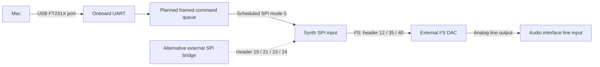

# IcePi Zero first-audio plan

The ordered board is the Crowd Supply **IcePi Zero**, carrying an ECP5-25F in
CABGA256 with 24,288 logic cells, 28 multiplier blocks and a 50 MHz oscillator.
The board has an onboard FT231X for USB programming and UART. These facts come
from the [manufacturer's product page](https://www.crowdsupply.com/icy-electronics/icepi-zero),
[build instructions](https://github.com/cheyao/icepi-zero/blob/e01faa2bd35dcb7269827f8420b845d46c78c869/gateware/README.md)
and [device/package selection](https://github.com/cheyao/icepi-zero/blob/e01faa2bd35dcb7269827f8420b845d46c78c869/gateware/Makefile).

**There is no qualified IcePi instrument bitstream yet.** The published
`reports/selected/linux-85f/ecp5.bit` targets ULX3S 85F/CABGA381 with a 25 MHz
input clock. It cannot be used on IcePi. Its 30,806 logic cells and 104
multiplier blocks also exceed the IcePi's capacity. Changing the device name,
package, or pin constraints will not make that implementation fit.

The earlier instruction to use the published baseline for physical playback
therefore needs this correction. No sound profile, score or tolerance changes
as a result of identifying the board.

## What is ready

`icepi_preflight.py` checks the real published record, verifies its bitstream
hash and reports the incompatibility. It never programs a board. It refuses
missing/malformed evidence rather than interpreting it as a fit. Even a
compatible resource screen is labelled `REQUIRES_BOARD_VERIFICATION`.

```sh
python3 fpga/icepi_preflight.py --out build/icepi/preflight.json
```

Expected exit: **1**, `INCOMPATIBLE`, including device, package, constraints
and resource excess. This is a valid negative finding, not an unexecuted test.
The [committed assessment](reports/icepi/preflight.json) preserves the build's
SPI→I²S simulation reference alongside the physical numbers. No new simulation
or route was needed to establish this incompatibility.

The optional `--synthesis-report /path/to/report.json` reads the recorded
netlist after checking its SHA-256, successful synthesis status, full HDL input
set and configuration against the publication. Applied to the saved local
synthesis at `dc7bae4`, it attributes all 104 multiplier cells:

| Historical selected build component | MULT18X18D cells |
| --- | ---: |
| Filter reconstruction/decimation (`rate_conv_2x`) | 76 |
| 2× oscillator | 12 |
| Ladder | 4 |
| Other voice arithmetic | 6 |
| Drums | 6 |

These are **historical synthesis measurements**, not a claim about current
pulse-2× resources or correctness. The rate converter is the concrete place
to investigate sharing arithmetic or mapping constant products to logic.
There are already 28 multiplier cells outside it, so merely shrinking it to
a few multipliers is insufficient. Preserve the exact coefficients, rounding,
headroom, samples and frame deadline when testing an implementation change.
Neither that fit nor enough logic capacity has been demonstrated.

The [older complete instrument](reports/ecp5_25f.txt) used 14 multiplier cells
and routed on a 25F in a ULX3S wrapper; its source is `912bbf1`, recorded in
[the old provenance](reports/provenance.txt). It is a possible legacy bring-up
fallback, not the improved sound candidate and not an IcePi build. Do not
silently switch a named selected preset to that engine.

## Clock and revision

Read the PCB revision when the boards arrive. Upstream v1.2 places the clock
at **M2**; v1.3/v1.4 place it at **M1**. The I/O below is common to those three
revisions. Older revisions are not qualified by this plan.

| PCB | Official constraints |
| --- | --- |
| 1.2 | [v1.2 LPF](https://github.com/cheyao/icepi-zero/blob/e01faa2bd35dcb7269827f8420b845d46c78c869/gateware/v1.2/icepi-zero-v1_2.lpf) |
| 1.3 | [v1.3 LPF](https://github.com/cheyao/icepi-zero/blob/e01faa2bd35dcb7269827f8420b845d46c78c869/gateware/v1.3/icepi-zero-v1_3.lpf) |
| 1.4 | [v1.4 LPF](https://github.com/cheyao/icepi-zero/blob/e01faa2bd35dcb7269827f8420b845d46c78c869/gateware/v1.4/icepi-zero-v1_4.lpf) |

```sh
python3 fpga/scripts/pll_search.py --fin 50 --top 3
# Only after checking the silkscreen; replace 1.3 with the actual revision:
python3 fpga/icepi_preflight.py --revision 1.3 --out build/icepi/revision-plan.json
```

Calculated PLL candidate: `CLKI_DIV=2 CLKFB_DIV=1 CLKOP_DIV=29 CLKOS_DIV=59`.
It produces `725/59 MHz = 12.288135593 MHz`, hence 48,000.530 samples/s
(+11.03 ppm before oscillator tolerance). The input is 50 MHz, divided to a
25 MHz phase detector. An IcePi wrapper and fresh routing must verify this;
reusing the ULX3S input divider would be wrong. The PLL search's concluding
sentence about the ULX3S crystal tolerance does not describe the IcePi MEMS.

## Proposed wiring

The synth remains an I²S master. Use an external I²S DAC capable of 3.3 V
logic, 16-bit samples in 32-bit slots, approximately 48 kHz LRCLK and
3.072 MHz BCLK. Prefer a receiver able to derive its clock from BCLK because
the current core does not export MCLK. The DAC model and its supply wiring
remain to be selected; digital GPDI capability does not implement an audio
output in our current gateware.

Numbers below are **physical 40-pin header positions**, not GPIO numbers.
They are proposed signal assignments for the forthcoming wrapper, not a claim
that the existing 85F artifact drives these pins.

| Connection | IcePi GPIO | Header pin | FPGA site | Direction at IcePi |
| --- | ---: | ---: | --- | --- |
| DAC BCLK | 18 | 12 | N4 | Output |
| DAC LRCLK / WS | 19 | 35 | E4 | Output |
| DAC DIN | 21 | 40 | F2 | Output |
| External SPI bridge SCK | 11 | 23 | G2 | Input |
| External SPI bridge MOSI | 10 | 19 | L2 | Input |
| External SPI bridge MISO | 9 | 21 | J1 | Output |
| External SPI bridge CS_N | 8 | 24 | H2 | Input |
| Common digital ground | — | 6 | — | Ground |

Use 3.3 V signalling and join bridge/DAC digital grounds. Do not connect a
second master to the same SPI lines. Resolve DAC power from its actual module
documentation, rather than assuming its supply voltage from its logic voltage.



The onboard UART pins are FPGA RX **K16**, TX **K15**. This makes a USB-UART
queue/serializer a possible way to avoid another bridge purchase. It is
**not implemented** by the current board wrapper, and an FT231X serial port
is not an existing SPI playback API. Programming support alone does not
establish live control.

## Playback software contract

Reuse `spi_host.py`'s 48-bit transactions and scheduling, including the kick
and tom coefficient writes. `play.py` currently renders the model only.

The physical transport must implement and test:

1. Framed, checked commands; boot-image completion and explicit error replies.
2. Mode-0, MSB-first 48-bit writes, no faster than 2 MHz SCK, with CS_N high
   for at least four core cycles between transactions.
3. A device-side schedule with bounded queue capacity, no silent drops, and
   measured late-command/underrun behavior. Mac sleeps and USB arrival time do
   not provide frame-accurate kick/tom coefficient updates. At the link limit,
   one write still takes more than one 48 kHz frame; preserve the scheduler's
   serialization rather than requiring simultaneous on-wire writes.
4. Status decoding: magic `0x4D`, version 2, overrun, queue, overflow, fresh
   flag and wrapping 16-bit frame counter. A read-only probe clocks **32 bits**;
   a 48-bit zero transaction would be a write. Status is not register readback.
5. A simulation that sends the same bridge packets, observes actual SPI edges,
   and compares decoded I²S samples, including missing/corrupt/late-packet
   controls. Test the path that will run on the board.

## Programming and first capture

The manufacturer supports SRAM programming with:

```sh
openFPGALoader -b icepi-zero path/to/qualified-icepi.bit
# Explicit cable form if the installed loader lacks the board alias:
openFPGALoader -cft231X --pins=7:3:5:6 path/to/qualified-icepi.bit
```

These are command templates: `qualified-icepi.bit` does not exist yet. Use the
board's FT231X USB port and a data cable. Initial SRAM loading leaves the
power-on flash image intact. The ULX3S bitstream is not a substitute.

The future IcePi artifact package must contain its exact SHA-256, PCB revision,
LPF and HDL hashes, all three DSP flags, matching host register encoding,
nonempty passed timing/resource reports, bridge firmware/protocol version,
and simulated SPI→I²S evidence. A resource-only screen must not publish it as
playable. Pulse 2× requires its own fit/timing result.

First capture order: held note → scripted phrase → drums with coefficient
schedules → live MIDI. Start with a muted or low-level line output; capture
both DAC channels through an interface's **line input**, with normalization,
AGC and effects disabled. Record the interface, gain, sample rate, input peak,
raw WAV hash, bitstream hash and exact script. Compare pitch, timing, stereo
agreement, clipping and dropped events against the matching digital expected
audio; analog capture is not expected to match sample-for-sample.

## Remaining work and evidence ledger

| Deliverable | Status |
| --- | --- |
| Ordered board family | Confirmed: IcePi Zero |
| PCB revision | Await silkscreen on arrival |
| Hardware-specific wiring / clock proposal | Documented; source checked |
| Published 85F artifact compatibility | Measured incompatible |
| IcePi wrapper, resource fit, timing and bitstream | Not implemented / not built |
| Mac physical playback transport | Not implemented; onboard UART route identified |
| DAC and capture interface | Models not yet identified |
| Physical playback / line capture | Await hardware and above prerequisites |
| M1A attack and filter-envelope qualification | Remains a separate sound task; unchanged here |

Validation: all 11 new tests failed against behaviorless stubs before the
implementation; all 11 then passed. Controls reject over-capacity resources,
wrong identity, missing/invalid counts, unsupported revisions and altered
netlists. A compatible synthetic resource record remains explicitly unqualified
for programming. The real 85F record returns `INCOMPATIBLE`.

Wrong-then-right record: **one hardware-planning assumption corrected** (using
the ULX3S published baseline for the newly identified IcePi). No sound
measurements or acceptance limits changed; no new acoustic measurement is
claimed. The 76-cell attribution is measured from the existing netlist, with
the producing code committed alongside it.
